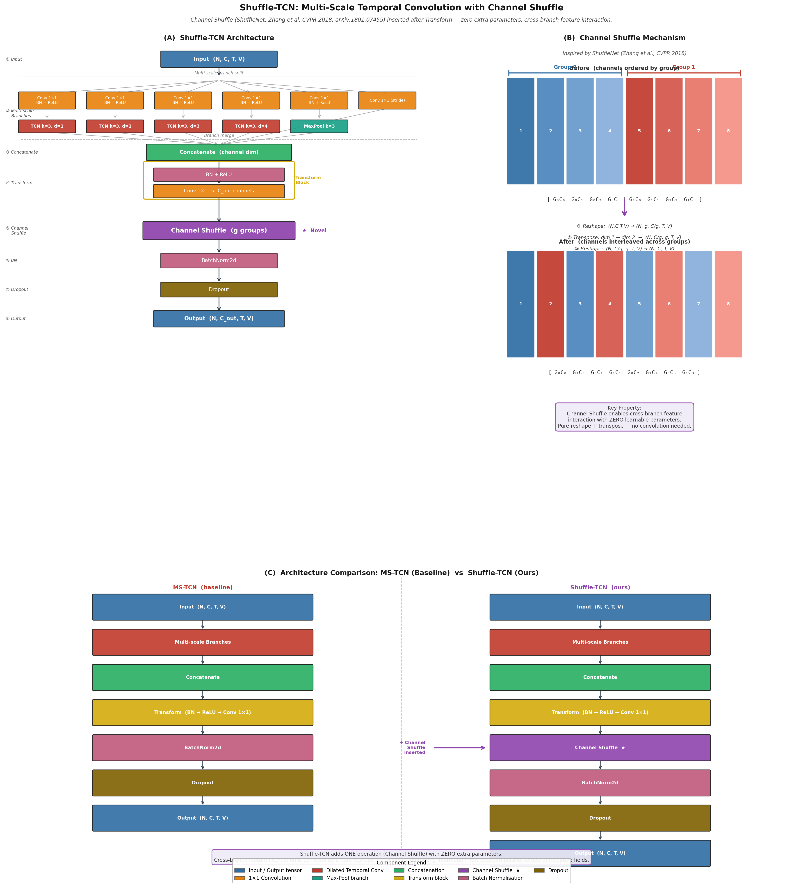

# Shuffle-STGCN

基于 [MMAction2](https://github.com/open-mmlab/mmaction2) 框架，在 **ST-GCN / ST-GCN++** 算法基础上的改进工作

---

## 改进概述

本项目将 **ShuffleNet**（Zhang et al., CVPR 2018, [arXiv:1801.07455](https://arxiv.org/abs/1801.07455)）的通道混洗（Channel Shuffle）机制引入骨骼动作识别的时序卷积模块（TCN），提出 **Shuffle-TCN**，替换原始 ST-GCN++ 中的 MS-TCN 模块。

核心思想：多尺度时序卷积的各并行分支在特征融合后，不同分支所提取的特征仍相对孤立。通过在特征变换（Transform）之后、批归一化（BN）之前插入一次 Channel Shuffle 操作，以**零额外参数**的代价实现跨分支的特征交互，增强网络对时序动态的表达能力。

---

## Shuffle-TCN 模块详解

**Shuffle-TCN 模块位置：** `mmaction/models/utils/gcn_utils.py`，class `shuffle_tcn`

### 网络结构图



> 图 (A) 完整 Shuffle-TCN 流程；(B) Channel Shuffle 机制细节；(C) 与 MS-TCN 对比。


> Channel Shuffle Module


> Downsample Module

---

## 配置文件

| 文件 | 说明 |
|------|------|
| `configs/skeleton/shuffle_stgcn/shuffle_stgcn.py` | 基础配置（模型结构定义） |
| `configs/skeleton/shuffle_stgcn/shuffle_stgcn_8xb16-joint-u100-80e_ntu60-xsub-keypoint-2d.py` | 完整训练配置（NTU RGB+D 60，xsub，2D 关键点） |

---

## 开启训练

```bash
bash shuffle_stgcn_train.sh
```

---

## References

- **ST-GCN**: Yan et al., *Spatial Temporal Graph Convolutional Networks for Skeleton-Based Action Recognition*, AAAI 2018
- **ST-GCN++**: Duan et al., *Revisiting Skeleton-Based Action Recognition*, CVPR 2022
- **ShuffleNet**: Zhang et al., *ShuffleNet: An Extremely Efficient Convolutional Neural Network for Mobile Applications*, CVPR 2018 ([arXiv:1801.07455](https://arxiv.org/abs/1801.07455))
- **MMAction2**: [https://github.com/open-mmlab/mmaction2](https://github.com/open-mmlab/mmaction2)
